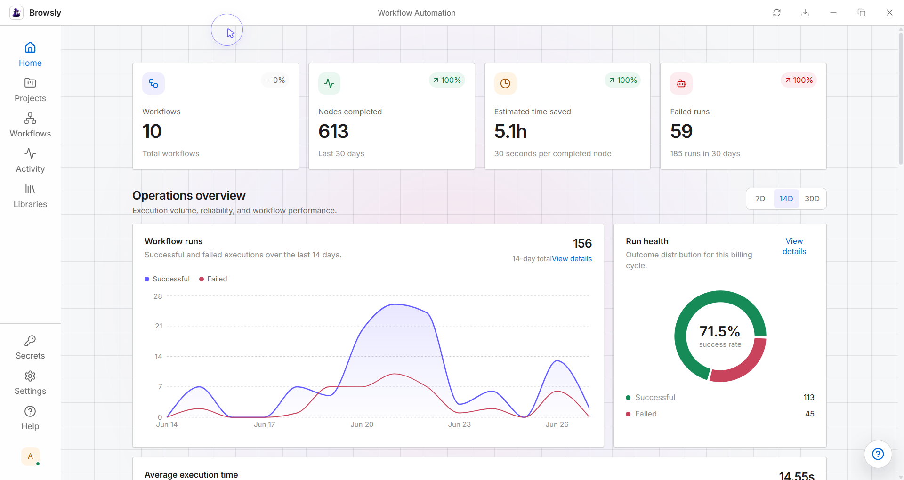
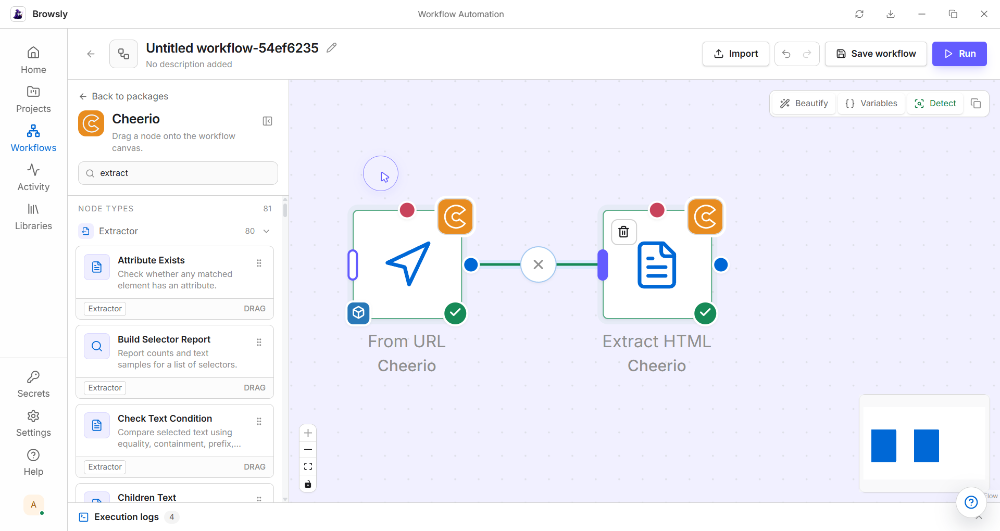
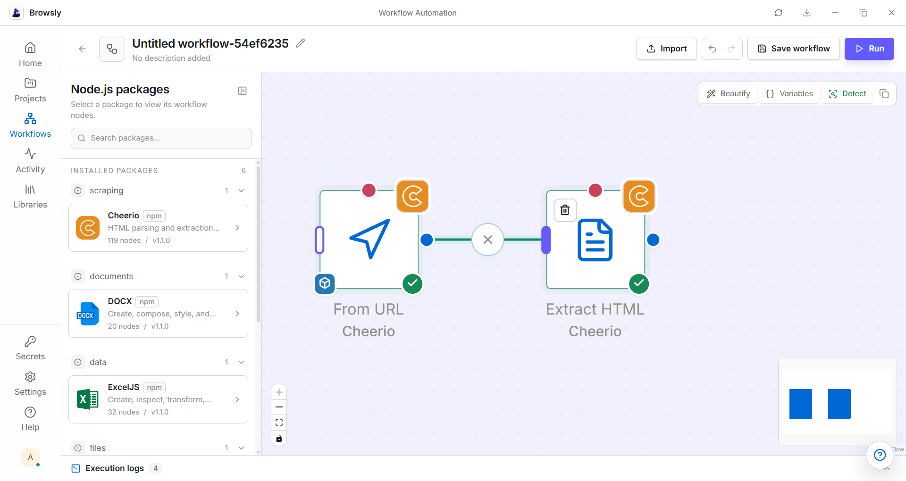
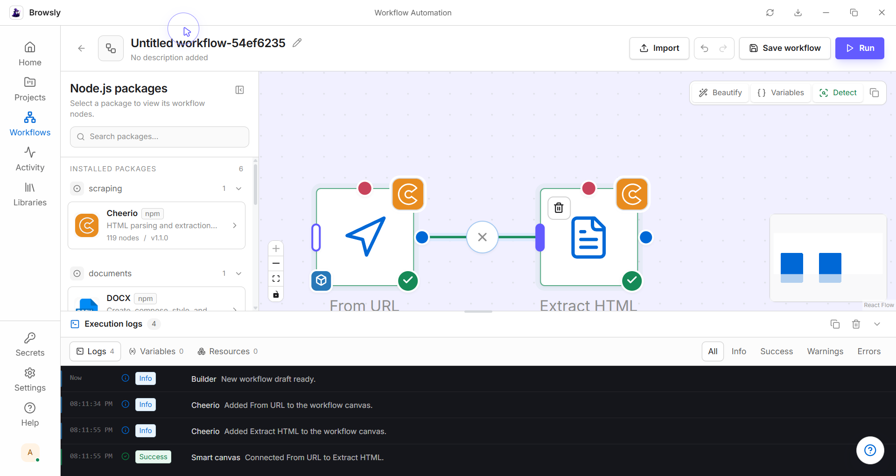
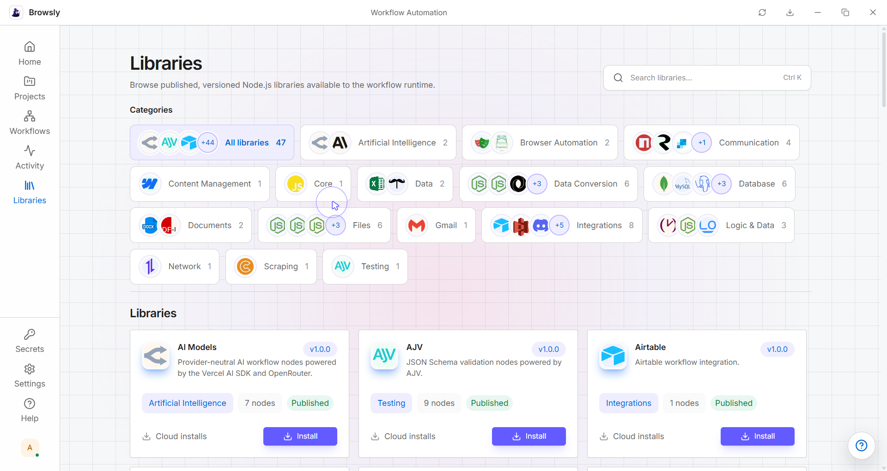
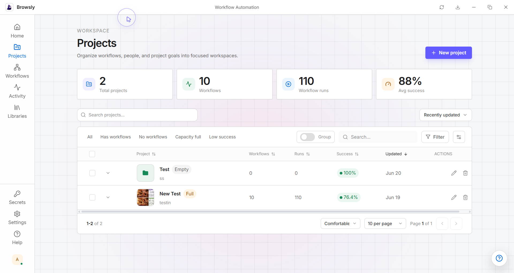
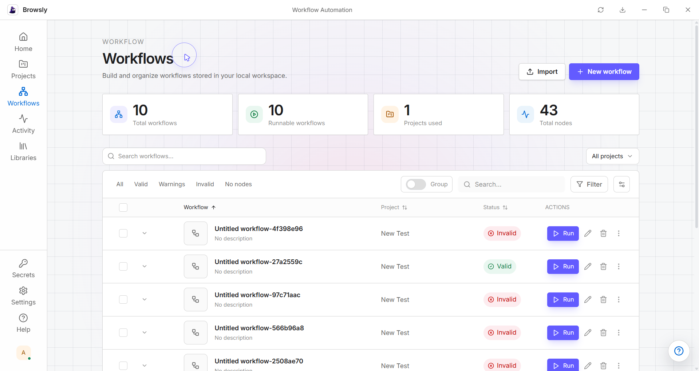
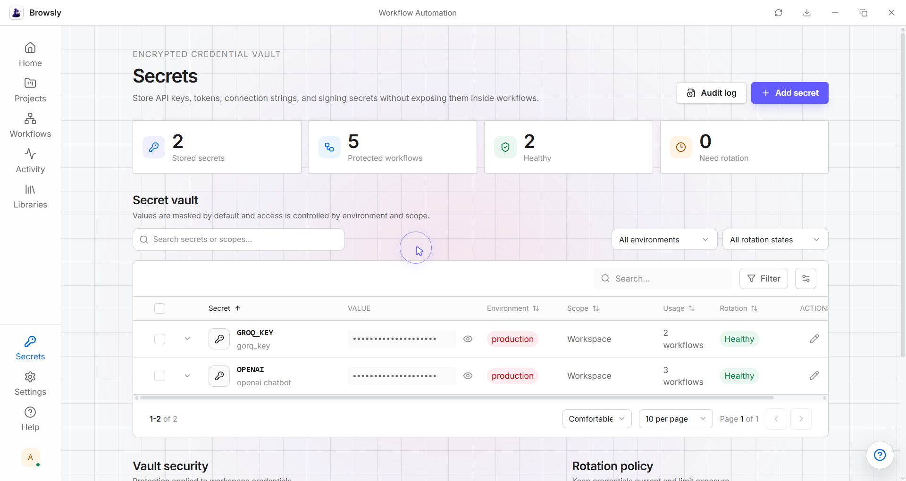
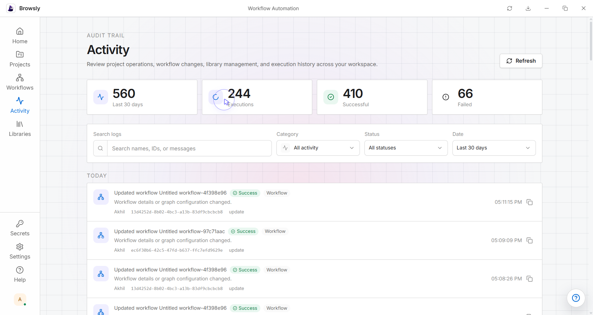
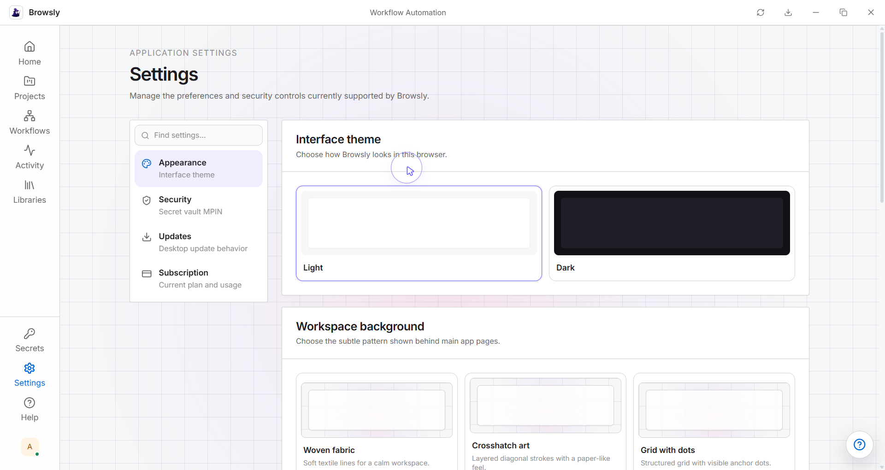

# Browsly – Offline Workflow Automation Builder for Windows

### Visual workflow automation for browser automation, desktop automation, API automation, file automation, scraping, data workflows and AI workflows.

Build, run, schedule, monitor and organize automation workflows from a local desktop app powered by reusable Node.js libraries.

> **Beta Testing:** Browsly is currently available through early-access Windows builds. Features and behaviour may change based on testing and user feedback.

[Download Latest Beta Release](https://github.com/browsly/browsly-downloads/releases/latest)
&nbsp;•&nbsp;
[View All Releases](https://github.com/browsly/browsly-downloads/releases)
&nbsp;•&nbsp;
[Report an Issue](https://github.com/browsly/browsly-downloads/issues/new)

---

## About This Repository

This is the official Windows download and release repository for **Browsly**.

It hosts beta installers, portable builds, release notes and update assets used by the Browsly desktop application. This repository contains compiled release files only. It does not contain the Browsly application source code.

## What Is Browsly?

**Browsly is an offline-first visual workflow automation platform for Windows.**

It turns supported Node.js packages into reusable workflow nodes, so users can build automation flows visually instead of manually writing and connecting every script, package, input, output and execution step.

With Browsly, you can:

- Build workflows on a drag-and-drop canvas
- Use Node.js libraries as workflow nodes
- Run workflows locally from your Windows machine
- Manage projects, workflows, libraries and secrets
- Review execution logs, variables, resources and failed runs
- Detect workflow issues before running
- Keep automation work organized in a clean desktop workspace

---

## Product Preview

### Dashboard and Operations Overview

Track workflow activity, completed nodes, estimated time saved, failed runs and overall run health from one dashboard.

### Visual Workflow Builder

Create workflows by placing nodes on the canvas, connecting steps and running the automation directly from the builder.

### Node Library Panel

Browse installed Node.js packages, search nodes and drag supported actions into the workflow canvas.

### Execution Logs

Review builder events, workflow runs, variables, resources, warnings and errors without leaving the workflow editor.

### Libraries

Browse published, versioned Node.js libraries available to the Browsly workflow runtime.

### Projects

Organize workflows into workspaces, view project health and manage workflow capacity from a table-based project view.

### Workflows

Search, filter, run and manage workflow drafts, valid workflows, invalid workflows and project-specific automations.

### Secrets

Store API keys, tokens, connection strings and signing secrets in an encrypted credential vault.

### Activity

Review audit trail events across projects, workflow updates, library management and execution history.

### Settings

Customize interface theme, workspace background, security settings, updates and subscription preferences.

---

## Key Features

| Feature | What it helps you do |
|---|---|
| **Visual Workflow Builder** | Build automation flows by connecting configurable nodes on a canvas |
| **Node.js Library Integration** | Use supported Node.js packages as reusable workflow actions |
| **Drag-and-Drop Node System** | Search packages, pick node types and place actions into workflows quickly |
| **Local Workflow Execution** | Run supported workflows from your Windows desktop environment |
| **Workflow Detection** | Detect workflow issues and missing setup before execution |
| **Execution Logs** | Review workflow events, outputs, warnings, resources and errors |
| **Project Management** | Group workflows into projects and track workflow success |
| **Library Marketplace** | Browse, install and manage versioned workflow libraries |
| **Secrets Vault** | Store API keys and credentials without exposing them inside workflows |
| **Activity Audit Trail** | Track workflow changes, project operations and execution history |
| **Workflow Monitoring** | View run health, failed runs, success rate and recent execution activity |
| **Automatic Updates** | Receive update notifications when newer beta releases are published |

---

## Workflow Builder Capabilities

Browsly is designed around a simple workflow-building flow:

1. **Choose a library**  
   Browse installed or published Node.js libraries such as scraping, documents, data, AI, browser automation and integrations.

2. **Select a node**  
   Pick a node type from the package panel and drag it into the workflow canvas.

3. **Connect steps**  
   Link nodes visually to define the automation path.

4. **Configure inputs**  
   Add variables, resources, credentials and node-specific settings.

5. **Detect issues**  
   Use workflow detection to identify missing setup, invalid connections or incomplete steps.

6. **Run locally**  
   Execute the workflow from your Windows desktop app.

7. **Review logs**  
   Inspect logs, variables, resources, warnings and errors after the run.

---

## Common Use Cases

Browsly can support workflows such as:

- Browser automation and website interaction flows
- HTML scraping and extraction workflows
- API automation and data movement
- Document generation and file processing
- Spreadsheet and data transformation workflows
- AI workflow prototyping with local or connected services
- Internal tool automation for teams
- Scheduled desktop automation tasks
- Local workflow testing before production implementation
- Reusable automation pipelines powered by Node.js packages

Available capabilities depend on the Browsly version, installed libraries, node configuration, credentials and local system permissions.

---

## Beta Testing

Browsly is currently in beta testing.

The available releases are early-access builds intended for testers and users who want to explore the platform before its stable release. During the beta period:

- Features may be added, changed or removed
- Some workflows may behave differently across releases
- Bugs and incomplete functionality may still be present
- UI and workflow behaviour may change based on feedback
- Important workflows should be tested before production use

Please report reproducible issues through the [GitHub issue tracker](https://github.com/browsly/browsly-downloads/issues).

---

## Download Browsly

Get the newest Windows beta build from the official GitHub Releases page:

### [Download the Latest Browsly Beta Release](https://github.com/browsly/browsly-downloads/releases/latest)

A release may include:

| Release asset | Best for |
|---|---|
| **Windows installer `.exe`** | Standard installation and automatic updates |
| **Portable build `.zip`** | Running Browsly without a traditional installation |
| **Release notes** | Reviewing new features, fixes, limitations and known changes |
| **Checksums** | Verifying downloaded files when checksums are supplied |

> **Security notice:** Download Browsly only from this repository or another official Browsly channel. Avoid installers distributed by third-party download websites.

---

## Install Browsly on Windows

### Using the Windows installer

1. Open the [latest release](https://github.com/browsly/browsly-downloads/releases/latest).
2. Download the Windows installer ending in `.exe`.
3. Open the downloaded installer.
4. Follow the installation instructions.
5. Launch Browsly from the Start menu or desktop shortcut.

### Using the portable version

1. Open the [latest release](https://github.com/browsly/browsly-downloads/releases/latest).
2. Download the portable package ending in `.zip`, when available.
3. Extract the ZIP archive to a folder you control.
4. Open the included Browsly application file.

Portable builds may store application files and settings differently from installed builds.

---

## System Requirements

| Requirement | Minimum |
|---|---|
| **Operating system** | Windows 10 64-bit or newer |
| **Memory** | 4 GB RAM minimum |
| **Storage** | Enough space for Browsly, libraries, workflow files and execution data |
| **Internet** | Required for downloads, updates, libraries and external services |

Some workflows may require additional memory, permissions, runtimes, API credentials or network access.

---

## Verify Your Download

For a safer installation:

1. Confirm that the download URL begins with `https://github.com/browsly/browsly-downloads/`.
2. Download files only from the repository's **Releases** section.
3. Verify the checksum when a release provides one.
4. Do not install copies from unofficial software-download websites.
5. Report unexpected installer behaviour through the public issue tracker.

---

## Troubleshooting

Before reporting a problem:

1. Confirm that you are using the latest beta release.
2. Restart Browsly and try the action again.
3. Check whether Windows or security software blocked the application.
4. Record the exact error message.
5. Note the workflow step or action that caused the problem.

When creating an issue, include:

- Browsly version
- Windows version
- Installation type, such as installer or portable
- Steps to reproduce the problem
- Expected and actual behaviour
- Relevant error messages
- Screenshots or logs with sensitive information removed

### [Report a Browsly Installation or Release Issue](https://github.com/browsly/browsly-downloads/issues/new)

Do not publish passwords, API keys, private workflow data, access tokens or confidential files in a public issue.

---

## Frequently Asked Questions

### Is Browsly ready for production use?

Browsly is currently in beta testing. Test important workflows carefully before relying on them in production or business-critical environments.

### Is this the Browsly source-code repository?

No. This repository distributes official compiled Browsly releases and update assets. It does not contain the application source code.

### Does Browsly work offline?

Browsly is designed as an offline-first application and supports local workflow execution. An internet connection may still be required to download the app, install libraries, access external services or receive updates.

### Which operating systems are supported?

The releases in this repository currently target 64-bit Windows systems running Windows 10 or newer.

### Can Browsly use Node.js libraries?

Yes. Browsly is designed to transform supported Node.js libraries into configurable workflow nodes. Compatibility can vary by package, version, permissions and runtime behaviour.

### Can I store API keys safely?

Browsly includes a secrets vault for storing keys, tokens and connection strings. Do not share secrets publicly in issues, screenshots or logs.

### Where can I download the newest version?

Use the permanent [latest release link](https://github.com/browsly/browsly-downloads/releases/latest). It redirects to the newest release published in this repository.

### How do I know whether an installer is official?

Check that it was downloaded from the **Releases** section of `browsly/browsly-downloads`. Do not trust repackaged installers hosted on unrelated websites.

---

## Repository Purpose

This repository is maintained for:

- Publishing official Browsly desktop beta releases
- Supporting the application update process
- Preserving release history
- Providing stable public download links
- Sharing release notes and checksums
- Collecting installation and release-related feedback
- Tracking reproducible beta issues

---

## Licensing

This is a binary distribution repository. Public availability of release files does not by itself grant an open-source licence or permission to modify, redistribute, reverse engineer or commercially reuse Browsly.

Refer to the licence terms supplied with the application or provided by the Browsly maintainers.

---

## Support Browsly

If Browsly is useful to you:

- Star this repository
- Test the latest beta release
- Share the official release link
- Report reproducible bugs
- Suggest practical improvements
- Keep your installation updated

---

**Browsly**

Offline-first visual Node.js workflow automation for Windows

**Currently in Beta Testing**

[Latest Release](https://github.com/browsly/browsly-downloads/releases/latest)
&nbsp;•&nbsp;
[Release History](https://github.com/browsly/browsly-downloads/releases)
&nbsp;•&nbsp;
[Issues](https://github.com/browsly/browsly-downloads/issues)

