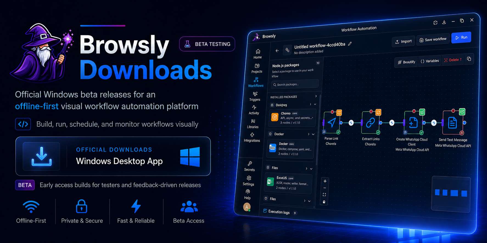

 
# Browsly

### Visual Workflow Automation Platform for Windows

Build offline-first desktop automation workflows with a drag-and-drop builder powered by Node.js libraries.

> **Beta Testing:** Browsly is currently available through early-access Windows builds. Features and behaviour may change based on testing and user feedback.

[Download Latest Beta Release](https://github.com/browsly/browsly-downloads/releases/latest)
&nbsp;•&nbsp;
[View All Releases](https://github.com/browsly/browsly-downloads/releases)
&nbsp;•&nbsp;
[Report an Issue](https://github.com/browsly/browsly-downloads/issues/new)

---

## About This Repository

This is the official Windows download and release repository for **Browsly**.

It hosts beta installers, portable builds, release notes, and update assets used by the Browsly desktop application. This repository contains compiled release files only. It does not contain the Browsly application source code.

## What Is Browsly?

**Browsly is an offline-first visual workflow automation platform for Windows.** It turns Node.js libraries into reusable drag-and-drop workflow nodes, helping users create automations without manually connecting every script, package, and execution step.

With Browsly, you can visually design a workflow, configure its inputs, run it locally, inspect execution logs, expose local API endpoints, and schedule workflows from one desktop application.

## Beta Testing

Browsly is currently in beta testing.

The available releases are early-access builds intended for testers and users who want to explore the platform before its stable release. During the beta period:

- Features may be added, changed, or removed
- Some workflows may behave differently across releases
- Bugs and incomplete functionality may still be present
- User feedback will help guide product improvements
- Important workflows should be tested before production use

Please report reproducible issues through the [GitHub issue tracker](https://github.com/browsly/browsly-downloads/issues).

## Download Browsly

Get the newest Windows beta build from the official GitHub Releases page:

### [Download the Latest Browsly Beta Release](https://github.com/browsly/browsly-downloads/releases/latest)

A release may include:

| Release asset | Best for |
|---|---|
| **Windows installer (`.exe`)** | Standard installation and automatic updates |
| **Portable build (`.zip`)** | Running Browsly without a traditional installation |
| **Release notes** | Reviewing new features, fixes, limitations, and known changes |
| **Checksums** | Verifying a downloaded file when checksums are supplied |

> **Security notice:** Download Browsly only from this repository or another official Browsly channel. Avoid installers distributed by third-party download websites.

## Key Features

| Feature | What it helps you do |
|---|---|
| **Visual Workflow Builder** | Build automation flows by connecting configurable nodes on a visual canvas |
| **Node.js Library Integration** | Turn supported Node.js packages and libraries into reusable workflow actions |
| **Local Workflow Execution** | Run supported workflows directly from your Windows computer |
| **Workflow Scheduler** | Run recurring or time-based workflows automatically |
| **Local API Endpoints** | Trigger supported workflows through endpoints available in your local environment |
| **Execution Logs and Monitoring** | Review workflow runs, outputs, errors, and execution status |
| **Library Marketplace** | Discover and add supported workflow libraries and nodes |
| **Automatic Updates** | Receive notifications when a newer Browsly beta version is available |

## Common Use Cases

Browsly can support workflows such as:

- Automating repetitive developer and operations tasks
- Connecting Node.js packages through a visual workflow
- Building local data-processing pipelines
- Running scheduled desktop automations
- Creating reusable internal tools
- Prototyping automation logic before writing a full application
- Triggering local workflows through API endpoints
- Monitoring workflow execution and troubleshooting failed steps

Available capabilities depend on the Browsly version, installed libraries, node configuration, and local system permissions.

## Install Browsly on Windows

### Using the Windows installer

1. Open the [latest release](https://github.com/browsly/browsly-downloads/releases/latest).
2. Download the Windows installer ending in `.exe`.
3. Open the downloaded installer.
4. Follow the installation instructions.
5. Launch Browsly from the Start menu or desktop shortcut.

### Using the portable version

1. Open the [latest release](https://github.com/browsly/browsly-downloads/releases/latest).
2. Download the portable package ending in `.zip`, when available.
3. Extract the ZIP archive to a folder you control.
4. Open the included Browsly application file.

Portable builds may store application files and settings differently from installed builds.

## System Requirements

### Windows

- Windows 10 64-bit or newer
- 4 GB RAM minimum
- Sufficient storage for Browsly, installed libraries, workflow files, and execution data
- Internet connection for downloading Browsly, libraries, and application updates

Some workflows may require additional memory, storage, permissions, runtimes, API credentials, or network access.

## Automatic Updates

Browsly checks for new releases through this repository.

When an update is available, the application can display an update notification. Follow the in-app instructions or return to the [latest release page](https://github.com/browsly/browsly-downloads/releases/latest) to download it manually.

Because Browsly is currently in beta, review the release notes before updating important workflows.

## Verify Your Download

For a safer installation:

1. Confirm that the download URL begins with `https://github.com/browsly/browsly-downloads/`.
2. Download files only from the repository's **Releases** section.
3. Verify the checksum when a release provides one.
4. Do not install copies from unofficial software-download websites.
5. Report unexpected installer behaviour through the public issue tracker.

## Troubleshooting

Before reporting a problem:

1. Confirm that you are using the latest beta release.
2. Restart Browsly and try the action again.
3. Check whether Windows or security software blocked the application.
4. Record the exact error message.
5. Note the workflow step or action that caused the problem.

When creating an issue, include:

- Browsly version
- Windows version
- Installation type, such as installer or portable
- Steps to reproduce the problem
- Expected and actual behaviour
- Relevant error messages
- Screenshots or logs with sensitive information removed

### [Report a Browsly Installation or Release Issue](https://github.com/browsly/browsly-downloads/issues/new)

Do not publish passwords, API keys, private workflow data, access tokens, or confidential files in a public issue.

## Frequently Asked Questions

### Is Browsly ready for production use?

Browsly is currently in beta testing. Test important workflows carefully before relying on them in production or business-critical environments.

### Is this the Browsly source-code repository?

No. This repository distributes official compiled Browsly releases and update assets. It does not contain the application source code.

### Does Browsly work offline?

Browsly is designed as an offline-first application and supports local workflow execution. An internet connection may still be required to download the application, install libraries, access external services, or receive updates.

### Which operating systems are supported?

The releases in this repository currently target 64-bit Windows systems running Windows 10 or newer.

### Can Browsly use Node.js libraries?

Browsly is designed to transform supported Node.js libraries into configurable workflow nodes. Compatibility can vary by package, version, required permissions, and runtime behaviour.

### Where can I download the newest version?

Use the permanent [latest release link](https://github.com/browsly/browsly-downloads/releases/latest). It automatically redirects to the newest release published in this repository.

### How do I know whether an installer is official?

Check that it was downloaded from the **Releases** section of `browsly/browsly-downloads`. Do not trust repackaged installers hosted on unrelated websites.

## Repository Purpose

This repository is maintained for:

- Publishing official Browsly desktop beta releases
- Supporting the application update process
- Preserving release history
- Providing stable public download links
- Sharing release notes and checksums
- Collecting installation and release-related feedback
- Tracking reproducible beta issues

## Licensing

This is a binary distribution repository. Public availability of release files does not by itself grant an open-source licence or permission to modify, redistribute, reverse engineer, or commercially reuse Browsly.

Refer to the licence terms supplied with the application or provided by the Browsly maintainers.

## Support Browsly

If Browsly is useful to you:

- Star this repository
- Test the latest beta release
- Share the official release link
- Report reproducible bugs
- Suggest practical improvements
- Keep your installation updated

---

**Browsly**

Visual Node.js workflow automation for Windows

**Currently in Beta Testing**

[Latest Release](https://github.com/browsly/browsly-downloads/releases/latest)
&nbsp;•&nbsp;
[Release History](https://github.com/browsly/browsly-downloads/releases)
&nbsp;•&nbsp;
[Issues](https://github.com/browsly/browsly-downloads/issues)

